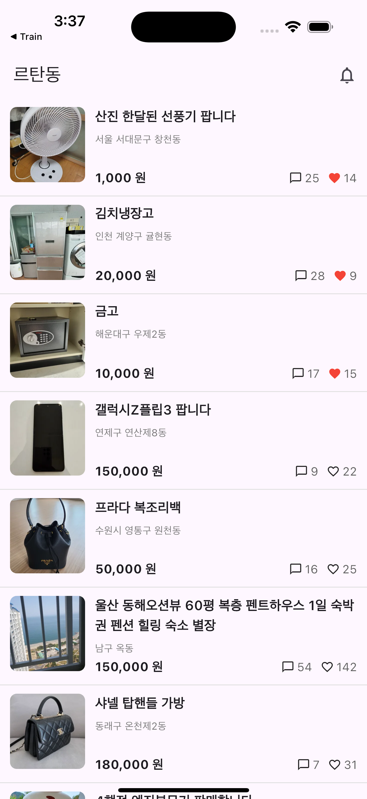

# 🍎 르탄동 사과마켓 (Flutter Clone Project)

Flutter와 Provider를 이용해 **중고거래 마켓 앱(사과마켓/당근마켓 스타일)**을 클론한 프로젝트입니다.  
상품 목록과 상세 화면, 좋아요/삭제/스크롤 이동 등 다양한 UI 및 상태 관리 기능을 구현했습니다.

---

## 📱 스크린샷

| 메인 화면                                | 상품 상세                                  |
| ---------------------------------------- | ------------------------------------------ |
|  |  |

---

## ✨ 주요 기능

### 1. 상품 목록

- CSV(`assets/data/products.csv`) 기반 **더미 데이터 로딩**
- `ListView.separated`로 상품 리스트 구현
- 이미지 **ClipRRect 라운드 처리**
- 제목은 **최대 2줄 + ellipsis(...)**
- 가격은 `NumberFormat`을 이용한 **천 단위 콤마**
- 아이템 간 회색 라인 구분
- 상단 종 아이콘 클릭 시 **SnackBar 알림**

### 2. 상품 상세

- **Navigator.push**로 `id` 전달 → Provider에서 상품 데이터 조회
- 상단 큰 이미지 / 판매자 카드 / 매너온도 UI
- 제목/내용 표시 (`\n` 문자열 제거 처리)
- 하단 고정 바 : 좌측 좋아요(하트), 중앙 가격, 우측 `채팅하기` 버튼

### 3. 추가 기능

- **좋아요(♥) 토글**
  - 상세 → 목록까지 Provider로 상태 동기화
- **롱클릭 시 상품 삭제**
  - `AlertDialog` 확인 후 삭제 처리
- **FloatingActionButton**
  - 스크롤 하단에서 등장 (fade 효과)
  - 누르면 최상단으로 부드럽게 스크롤
  - 클릭 시 아이콘이 `arrow_upward ↔ check` 변경

---

## 🗂 폴더 구조
